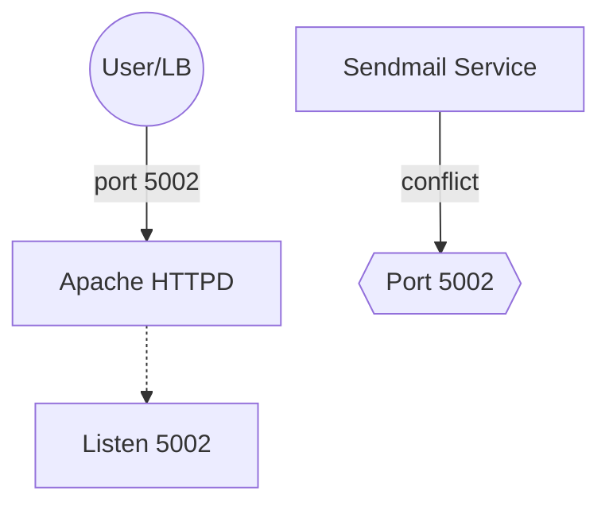

# Day 14: Linux Process Troubleshooting 🕵️‍♂️

> ### 🚀 Полювання на зайняті порти та конфліктні процеси
> Зіткнувся з класичною проблемою "Address already in use" під час налаштування Apache на нестандартному порту 5002. Вмінню швидко знайти процес, що блокує порт, та правильно розставити пріоритети служб — це те, що відрізняє інженера від користувача. Тепер Apache працює стабільно, а зайві служби вимкнені для безпеки.
> 
> **Problem-Solution-Value:** Виявив конфлікт з Sendmail, вивільнив порт та забезпечив консистентність конфігурації на всіх App-хостах.

## 1. Business & Infrastructure Context

*   **Why it matters:** Inconsistent service states across app servers cause intermittent Load Balancer failures, leading to increased MTTR (Mean Time To Recovery) and potential revenue loss during downtime.
*   **Cost Awareness (FinOps):** Disabling unused services like `sendmail` reduces memory footprints, allowing for higher resource density on smaller, cost-efficient EC2 instances (e.g., t3.micro).
*   **Operational Domain:**
    *   **Environment:** Cloud (App Server Cluster)
    *   **Layer:** OS (Linux), Network (Ports)
    *   **Stage:** Run / Troubleshooting
*   **The Risk:** Leave unused services running on non-standard ports, and you create a hidden attack surface for lateral movement if those services are vulnerable.

---

## 2. Lab Breakdown: Troubleshooting Apache Port Conflict

### Cloud Architecture (Diagram)


### Phase 1: Diagnostics
Identify why the service is failing to start.

```bash
# Check service status and basic logs
sudo systemctl status httpd
# Expected Result: Service is in 'failed' state with exit code.

# Inspect detailed error messages
sudo journalctl -xeu httpd
# Expected Result: Error "(98)Address already in use: AH00072: could not bind to address 0.0.0.0:5002"
```

### Phase 2: Conflict Resolution
Find the process occupying the required port.

```bash
# Analyze socket statistics to find the owner of port 5002
sudo ss -tulnp | grep 5002
# Expected Result: Output shows 'sendmail' (PID XXX) listening on port 5002.

# Stop and disable the conflicting service
sudo systemctl stop sendmail
sudo systemctl disable sendmail
# Expected Result: Services stopped and removed from startup.
```

### Phase 3: Service Recovery & Verification
Apply the fix and verify.

```bash
# Start Apache service
sudo systemctl start httpd
# Expected Result: Service starts successfully.

# Verify process and local connectivity
sudo systemctl status httpd
curl localhost:5002
# Expected Result: HTTPD is active/running and curl returns a response (even if 403/404).
```

---

## 3. DevOps Context & Alternatives
*   **In Kubernetes:** We specify `containerPort: 5002` in the Deployment and let the K8s Scheduler handle port allocation, avoiding host-level conflicts via Docker networking.
*   **Automation:** Using **Ansible**, we would use the `lineinfile` module to ensure `Listen 5002` is set and the `service` module to ensure `sendmail` is `state: stopped` and `enabled: no`.

## 4. Junior Pitfalls ⚠️
*   **Kill -9 Everything:** Juniors often use `kill -9` without checking why the process is there. This can cause data corruption or leave "zombie" processes.
*   **Ignoring SELinux:** Forgetting that SELinux might block Apache from binding to a non-standard port like 5002 even if it's free.

## 5. Summary for Interview (Best Practices)
*   Always use `ss` or `netstat` to verify port ownership before attempting re-config.
*   Follow the **Principle of Least Privilege**: if a service like Sendmail isn't needed, disable it (Hardening).
*   Differentiate between `SIGTERM` (graceful) and `SIGKILL` (forced) signals.
*   **White Hat Challenge:** If an attacker finds `sendmail` running on a weird port, they might exploit its known SMTP relay vulnerabilities to bypass external spam filters.

---
### 📚 Додаткові матеріали:
*   [**Deep Dive: SELinux та порти**](./SELINUX_DEEP_DIVE.md) — чому зміна порту часто ламає сервіси "мовчаки".

---
🔗 **Previous:** [Day 13: IPtables Configuration](../day13)
