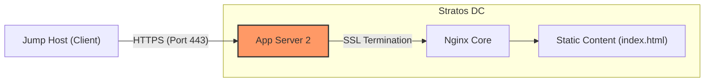

# Day 15: Setup SSL for Nginx 🛡️🌐

> **Hook:** Сайт без HTTPS — це як банківське сховище зі скляними дверима: кожен бачить, що всередині, і це лише питання часу, коли хтось цим скористається. 🕵️‍♂️
>
> **Problem-Solution-Value:** Незахищені внутрішні додатки відкривають двері для MitM-атак. Ми убезпечили App Server 2, впровадивши Nginx з SSL-термінацією та перемістивши вразливі ключі з тимчасового сховища до захищених системних директорій. Це гарантує шифрування всього внутрішнього трафіку та відповідність стандартам безпеки.
>
> **Call to Action:** Не дозволяй своїм даним подорожувати у відкритому вигляді. Захисти свої сервіси за допомогою Nginx SSL вже сьогодні! Повний гайд нижче. 👇

## Business & Infrastructure Context

### Why it matters:
In the modern web, encryption is not optional. For business, implementing SSL/TLS reduces the risk of data breaches, ensures regulatory compliance (like SOC2 or HIPAA), and improves user trust. Even for internal services, "Zero Trust" architecture dictates that we should never assume the internal network is safe.

### Operational Domain:
- **Environment:** Hybrid Cloud / Stratos Data Center.
- **Layer:** Application Layer (L7) & Transport Layer (L4 - TLS).
- **Stage:** Run (Security Hardening).

### The Risk:
Ignoring SSL leads to cleartext data transmission. If an attacker gains access to the local network (e.g., via a compromised developer machine), they can use tools like Wireshark to steal session tokens, credentials, and customer data.

## Lab Breakdown

### The Task:
Prepare **App Server 2** for deployment by installing Nginx and configuring it with a pre-provided self-signed SSL certificate.

### Cloud Architecture (Flow)


### Step-by-Step Implementation

### Step 1: Install Nginx
```bash
# Install the web server package using the package manager
sudo yum install nginx -y
# Enable and start the service to ensure it persists after reboot
sudo systemctl enable --now nginx
```
**Expected Result:** Nginx service is active and running on default port 80.

### Step 2: Hardening SSL Storage
```bash
# Create a dedicated directory for SSL certificates with restricted access
sudo mkdir -p /etc/nginx/ssl
# Move the self-signed certificate and key from insecure /tmp directory
sudo mv /tmp/nautilus.crt /etc/nginx/ssl/
sudo mv /tmp/nautilus.key /etc/nginx/ssl/
# Ensure the private key is not world-readable
sudo chmod 600 /etc/nginx/ssl/nautilus.key
```
**Expected Result:** Files moved to `/etc/nginx/ssl/`; permissions are hardened.

### Step 3: Configure SSL in Nginx
```bash
# Edit the configuration to enable SSL listener
# Inside the server block in /etc/nginx/nginx.conf:
# listen 443 ssl;
# ssl_certificate /etc/nginx/ssl/nautilus.crt;
# ssl_certificate_key /etc/nginx/ssl/nautilus.key;
```
**Expected Result:** Nginx is configured to terminate SSL on port 443.

### Step 4: Verify and Restart
```bash
# Test the configuration syntax for errors
sudo nginx -t
# Apply changes by restarting the service
sudo systemctl restart nginx
```
**Expected Result:** "syntax is ok" message followed by a successful service restart.

## DevOps Context & Alternatives
- **In Kubernetes:** We typically handle SSL at the **Ingress Controller** level (e.g., Nginx Ingress) using **cert-manager** to automatically provision and rotate Let's Encrypt certificates.
- **Automation:** In a real production environment, we wouldn't move files manually. We'd use **Ansible**'s `ansible.builtin.copy` module with proper `owner`, `group`, and `mode` set in a single task.

## Junior Pitfalls (Common Mistakes ⚠️)
- **Leaving keys in /tmp:** Anyone with a shell on the box can steal your private key.
- **Ignoring `nginx -t`:** Restarting Nginx with a broken config will crash your site. Always test first!
- **Wrong File Permissions:** If Nginx (running as a worker) cannot read the `.crt` file, the SSL handshake will fail.

## Summary for Interview (Best Practices)
1. **Defense in Depth:** Never trust the internal network; encrypt everything (Encryption in Transit).
2. **Key Protection:** Private keys must always have restrictive permissions (`600`) and be owned by the root user or the service user.
3. **Configuration Hygiene:** Use separate directory blocks for SSL (`/etc/nginx/ssl`) and include them in specific site configs rather than bloating the main `nginx.conf`.
4. **Validation:** Always use `nginx -t` before `systemctl restart`.
5. **Self-Signed Limitations:** Know that self-signed certs are for internal use only; public-facing sites must use CAs like Let's Encrypt.

---
**Previous Day:** [Day 14: Linux Process Troubleshooting](../day14)
