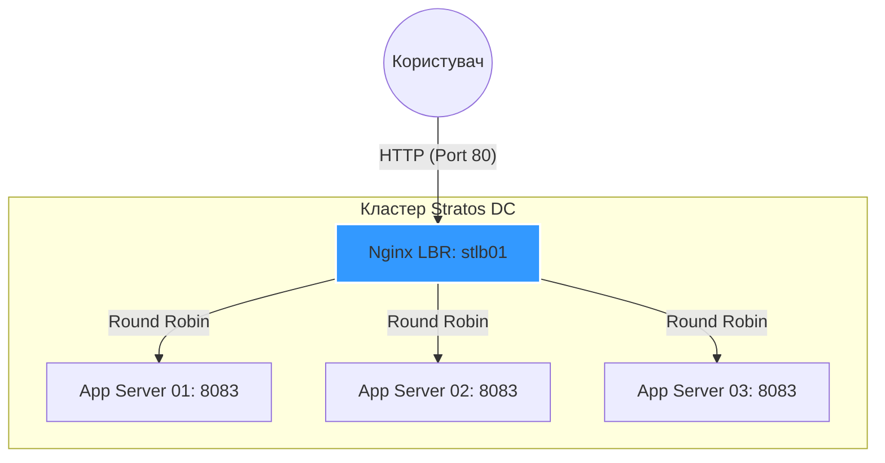

# День 16: Встановлення та налаштування Nginx як LBR ⚖️🌐

> **Hook:** Один сервер — це точка відмови, три сервери без нагляду — це хаос. Як Nginx перетворює розрізнену інфраструктуру на злагоджений оркестр? 🎼
>
> **Problem-Solution-Value:** Використання поодиноких App-серверів створює ризик простою при збоях або високому навантаженні. Ми налаштували Nginx як високонадійний балансувальник навантаження (LBR), що розподіляє трафік між кластером App-серверів на порту 8083. Це забезпечує **High Availability** та дозволяє системі масштабуватися без зміни клієнтських налаштувань.
>
> **Call to Action:** Не чекай, поки твій єдиний сервер "впаде" під напливом покупців у Чорну П'ятницю. Масштабуйся з Nginx вже сьогодні! Гайд нижче. 👇

## Бізнес та інфраструктурний контекст

### Чому це важливо:
Балансування навантаження є наріжним каменем **Надійності (Reliability)** та **Масштабованості (Scalability)**. Для бізнесу це означає забезпечення того, що збій одного екземпляра не призведе до недоступності сервісу (ціль — 0% downtime). Це також оптимізує використання ресурсів у всьому парку серверів, знижуючи MTTR за рахунок можливості розгортання blue-green або canary.

### Оптимізація витрат (FinOps):
- **Інфраструктура:** У хмарному середовищі (AWS/Azure) використання програмного LBR на базі Nginx на інстансі t3.micro може бути економнішим для невеликих навантажень, ніж керований Elastic Load Balancer (ELB), який має фіксовану погодинну вартість.
- **Оптимізація:** Правильне балансування запобігає надмірному виділенню ресурсів для окремих серверів для обробки піків.

### Операційна область:
- **Середовище:** Гібридна хмара / Stratos Data Center.
- **Рівень:** Прикладний рівень (L7) та Мережевий рівень (L4).
- **Етап:** Run (Управління трафіком та HA).

### Ризики:
Без LBR будь-яке технічне обслуговування або збій сервера додатків призводить до негайного простою. Крім того, пряме відкриття IP-адрес бекенд-серверів в інтернеті збільшує поверхню атаки для цілеспрямованих DDoS-атак або експлуатації вразливостей.

## Розбір лабораторної роботи: Налаштування Nginx Load Balancer

### Архітектура хмари (Потік даних)


### Покрокове впровадження

### Крок 1: Встановлення Nginx
```bash
# Оновлюємо індекс пакетів та встановлюємо Nginx на хост LBR
sudo yum install -y nginx
# Додаємо в автозапуск та запускаємо службу
sudo systemctl enable --now nginx
```
**Очікуваний результат:** Служба Nginx запущена та прослуховує порт 80.

### Крок 2: Налаштування балансування навантаження
```bash
# Редагуємо основний файл конфігурації
# Розміщуємо блок upstream всередині http { ... }
# Розміщуємо блок server для проксіювання запитів
sudo vi /etc/nginx/nginx.conf
```

**Фрагмент конфігурації:**
```nginx
http {
    # Визначаємо групу бекенд-серверів
    upstream stapp {
        server stapp01:8083;
        server stapp02:8083;
        server stapp03:8083;
    }

    server {
        listen 80;

        location / {
            # Передаємо трафік визначеній групі upstream
            proxy_pass http://stapp;
            # Зберігаємо заголовки клієнта для бекенда
            proxy_set_header Host $host;
            proxy_set_header X-Real-IP $remote_addr;
        }
    }
}
```
**Очікуваний результат:** Перевірка синтаксису `nginx -t` повертає "successful".

### Крок 3: Застосування та перевірка
```bash
# Перезавантажуємо Nginx без розриву з'єднань
sudo nginx -s reload
# Тестуємо балансування локально
curl http://localhost
```
**Очікуваний результат:** Отримано відповіді від різних серверів додатків у кластері.

## DevOps контекст та альтернативи
- **Cloud Native:** В AWS ми використовуємо **Application Load Balancers (ALB)**, які є керованими, високонадійними та нативно інтегруються з Auto Scaling Groups.
- **Мікросервіси:** У сервісній мережі (наприклад, Istio) балансування навантаження обробляється "sidecar" проксі (Envoy), що дозволяє виконувати складну маршрутизацію на основі заголовків або шляхів.
- **Альтернативи:** **HAProxy** — це спеціалізований високопродуктивний балансувальник навантаження, якому часто надають перевагу перед Nginx для дуже високої пропускної здатності на L4.

## Пастки для джунів (Поширені помилки ⚠️)
- **Хардкод IP-адрес:** Використання IP в `upstream` замість імен хостів (краще використовувати DNS/Service Discovery).
- **Ігнорування здоров'я бекенда:** Неналаштовані перевірки здоров'я (health checks), через що Nginx надсилає трафік на "мертві" сервери, поки не закінчиться час очікування.
- **Невідповідність портів:** Спроба балансувати трафік на порт 8080, коли додаток насправді слухає на 8083 (перевіряється через `ss -tulnp`).

## Резюме для співбесіди (Найкращі практики)
1. **Висока доступність:** Завжди групуйте сервери в блоці `upstream`, щоб уникнути SPOF.
2. **Безпека зворотного проксі:** Використовуйте Nginx, щоб приховати IP бекенд-серверів та надати єдину точку входу для патчів безпеки/WAF.
3. **Session Persistence:** Розуміння "Sticky Sessions" (використання `ip_hash`) для додатків зі станом (stateful).
4. **Weighted Balancing:** Використовуйте параметр `weight`, якщо ваші бекенд-сервери мають різні характеристики CPU/RAM.
5. **Пасивні перевірки:** Налаштуйте `max_fails` та `fail_timeout`, щоб Nginx міг автоматично "паркувати" сервери, що дають збої.
6. **White Hat Insight:** Неправильно налаштований LBR може розкрити чутливі заголовки або дозволити "Request Smuggling", якщо фронтенд і бекенд не узгоджують довжину контенту. [Читати Deep Dive про безпеку LBR](./LBR_SECURITY_DEEP_DIVE.md).

---
**Попередній день:** [День 15: Налаштування SSL для Nginx](../day15)
