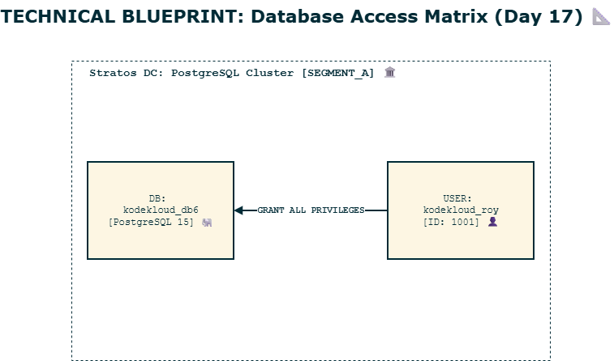

# День 17: Встановлення та налаштування PostgreSQL 🐘�

> **Hook:** Дані — це серце будь-якого сучасного застосунку. Але як надати доступ до серця так, щоб не поставити під загрозу весь організм? 💓🛡️
>
> **Problem-Solution-Value:** Використання спільних облікових записів або баз даних для різних застосунків створює вразливість для витоку даних. Ми налаштували PostgreSQL з чітким розмежуванням доступу: окрема база `kodekloud_db6` та виділений користувач `kodekloud_roy` з обмеженими правами. Це забезпечує **сильну ізоляцію (Tenant Isolation)** та відповідність стандартам безпеки Stratos DC.
>
> **Call to Action:** Побудуй надійну фортецю для своїх даних. Гайд по SecOps для баз даних нижче! 👇

## Бізнес та інфраструктурний контекст

### Чому це важливо:
Бази даних є критично важливою частиною **Infrastructure Compatibility**. Для бізнесу правильне налаштування DB означає цілісність даних та запобігання несанкціонованому доступу. У великих компаніях, як Nautilus, це також про **Audit Compliance** — кожен застосунок має свого "власника" в БД для відстеження змін та навантаження.

### Оптимізація витрат (FinOps):
- **On-premise:** Максимальне використання існуючого сервера бази даних Nautilus без необхідності піднімати нові інстанси.
- **Масштабування:** PostgreSQL ефективно використовує ресурси, дозволяючи сотні незалежних БД на одному потужному хості.

### Операційна область:
- **Середовище:** On-premise / Stratos Data Center.
- **Рівень:** Data Layer (Рівень даних).
- **Етап:** Setup & Access Management.

### Ризики:
Використання суперкористувачів (`postgres`) для застосунків призводить до катастрофічних наслідків при зломі (Privilege Escalation). Також, без обмеження прав, один застосунок може випадково видалити дані іншого.

## Розбір лабораторної роботи: PostgreSQL Account Management

### Архітектура (Доступ до даних)
Схема показує ізоляцію користувача всередині сегмента кластера.



### Покрокове впровадження

### Крок 1: Вхід у консоль керування
Ми працюємо від імені системного користувача `postgres` без перезапуску сервісу.
```bash
# Входимо в інтерактивний термінал PostgreSQL
sudo -u postgres psql
```
**Очікуваний результат:** Запрошення до вводу `postgres=#`.

### Крок 2: Створення користувача для застосунку
Ми створюємо роль з правом входу та встановлюємо складний пароль.
```sql
-- Створюємо користувача згідно з вимогами Nautilus DevOps
CREATE USER kodekloud_roy WITH PASSWORD 'dCV3szSGNA';
```
**Очікуваний результат:** Повідомлення `CREATE ROLE`.
**Перевірка:** Команда `\du` має показати роль `kodekloud_roy`.

### Крок 3: Створення виділеної бази даних
```sql
-- Створюємо БД для нового застосунку
CREATE DATABASE kodekloud_db6;
```
**Очікуваний результат:** Повідомлення `CREATE DATABASE`.

### Крок 4: Надання прав доступу (Granting Privileges)
```sql
-- Надаємо повний доступ лише до конкретної бази
GRANT ALL PRIVILEGES ON DATABASE kodekloud_db6 TO kodekloud_roy;
```
**Очікуваний результат:** Повідомлення `GRANT`.
**Перевірка:** `\l` показує власника та права для `kodekloud_db6`.

## DevOps контекст та альтернативи
- **Cloud Native:** В AWS ми використовуємо **Amazon RDS** або **Aurora**, де керування користувачами часто інтегрується з **IAM Database Authentication** для безпарольного входу.
- **Контейнеризація:** У Kubernetes бази даних часто розгортаються через **Operators** (наприклад, Zalando або CrunchyData), що автоматизують створення користувачів через Custom Resources.
- **IaaC:** В реальних проектах ці дії виконуються через Terraform провайдер `postgresql` або Ansible модулі `postgresql_user` та `postgresql_db`.

## Пастки для джунів (Поширені помилки ⚠️)
- **Паролі в CLI:** Передача пароля прямо в командному рядку `psql -c "..."` — пароль потрапляє в `history`. Завжди використовуйте інтерактивний режим або змінні оточення.
- **Забуті коми:** SQL чутливий до синтаксису, кожна команда має закінчуватися `;`.
- **Перезапуск сервісу:** Непотрібний `restart` може обірвати сесії інших застосунків, що працюють на цьому ж сервері.

## Резюме для співбесіди (Best Practices)
1. **Least Privilege:** Ніколи не використовуйте `SUPERUSER` для застосунків. Лише необхідні права на конкретну БД/схему.
2. **Reload vs Restart:** Зміни в користувачах та правах в PG не потребують навіть релоаду, вони активні миттєво.
3. **Secrets Management:** Паролі мають зберігатися в HashiCorp Vault або AWS Secrets Manager, а не в коді чи скриптах налаштування.
4. **Owner-based Access:** Зазвичай краще робити користувача застосунку власником (`OWNER`) його бази даних.
5. **White Hat Insight:** За замовчуванням PostgreSQL може дозволяти підключення з локальної мережі без SSL. Завжди перевіряйте `pg_hba.conf` на відповідність стандартам безпеки. [Детальніше про ролі в Deep Dive](./DEEP_DIVE_POSTGRES_ROLES.md).

---
**Попередній день:** [День 16: Налаштування Nginx як LBR](../day16)
